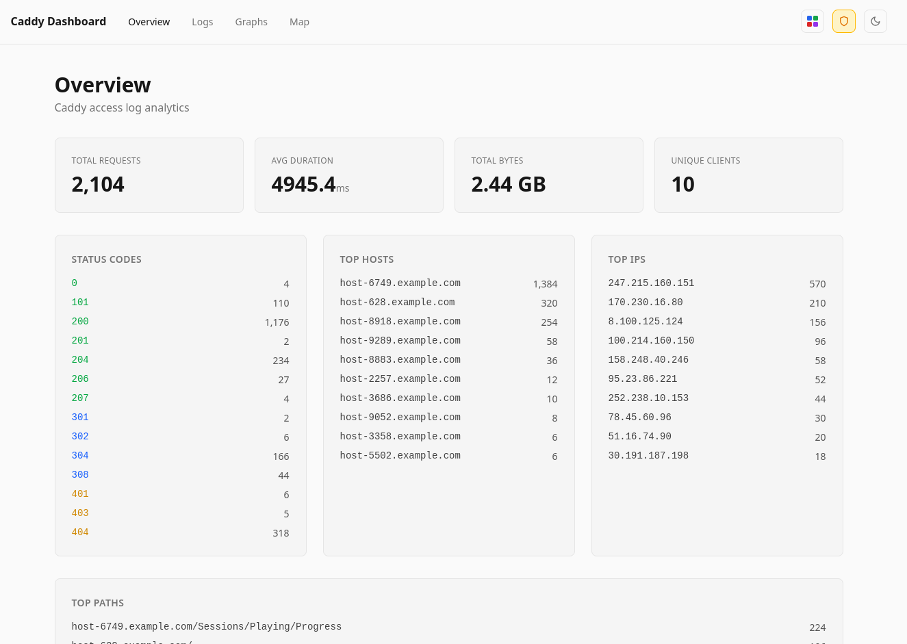
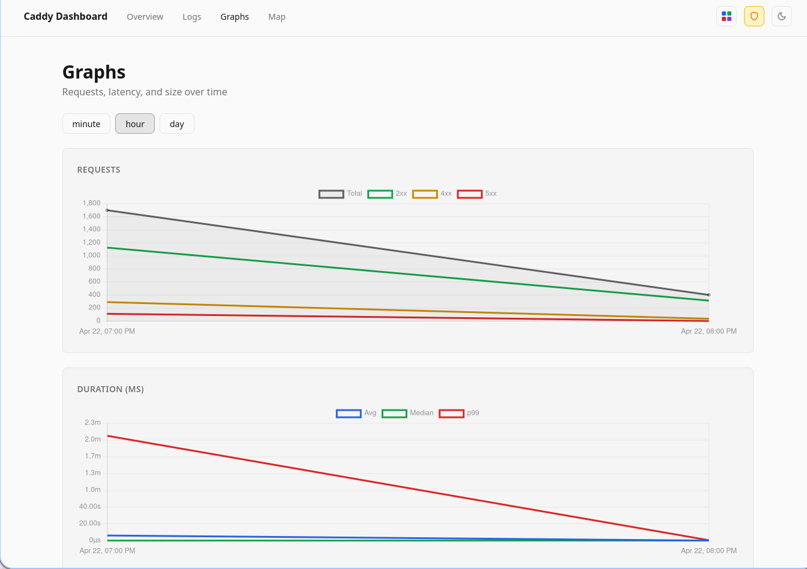
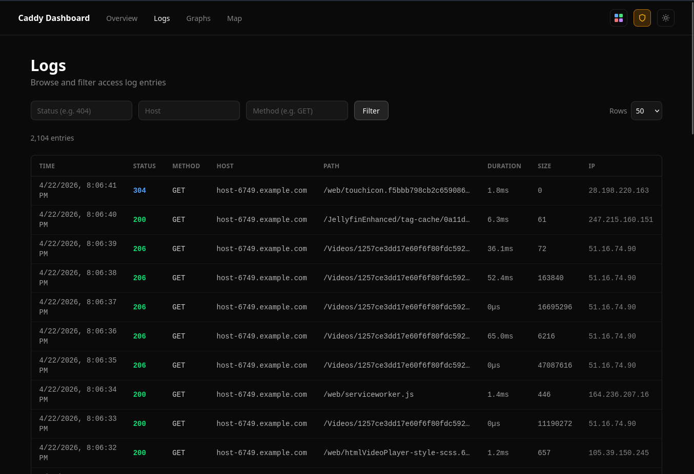
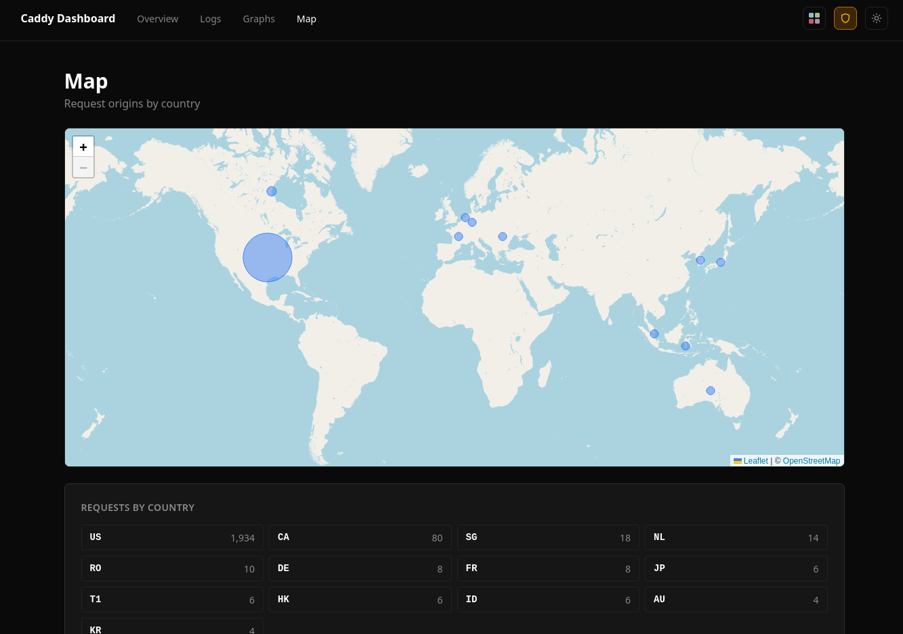

# caddy-dashboard

A self-hosted analytics dashboard for [Caddy](https://caddyserver.com/) access logs.

**Stack:** Rust (actix-web) · SvelteKit · Tailwind CSS v4 · redb · Chart.js · Leaflet


## Goals

I wanted to create a project where it was super easy to deploy and immediately get some decent visualizations into what kind of traffic you have.

This is the recommended log settings that I use for my personal Caddy instance

- Excludes inter-traffic, because I want more visibility on external traffic, not internal.
- Reasonable rollover defaults, but currently caddy-dashboard will only fetch incoming logs that it sees. It does not retroactively retrieve logs.
- You can just get rid of roll over logs if you want to rely on caddy-dashboard to hold onto historical data.
- Excludes Uptime Kuma to reduce some noise.

```
(log_settings) {
    log {
        output file /config/access.log {
            roll_size 30MB
            roll_keep 5
            roll_keep_for 720h
        }
        level debug
    }
    @name {
        client_ip 172.18.0.0/12
        client_ip 192.168.0.0/12
    }

    @uptime-kuma-agent {
        header User-Agent Uptime-Kuma*
    }

    # Skip logging for specific IP ranges
    log_skip @name
    log_skip @uptime-kuma-agent
}
```


## Features

- **Overview** — total requests, status code breakdown, top hosts/IPs/paths (host + path combined), slowest paths (avg + p99 duration)
- **Logs** — paginated, filterable log table with configurable page size and direct page navigation
- **Graphs** — requests over time, response duration (avg/median/p99), payload size (avg/median/p99), unique hosts — bucketed by minute/hour/day — with human-readable axis units (ms/s/m, B/KB/MB)
- **Map** — request origins plotted on an interactive world map using Cloudflare's `Cf-Ipcountry` header (no GeoIP database required)
- **Color themes** — 6 presets (Default, Nord, Dracula, Catppuccin, Sunset, Neon) applied to charts, persisted to localStorage
- **Light/dark mode** — persisted to localStorage
- **Real-time streaming** — SSE endpoint (`/api/logs/stream`) tails new log entries as they arrive
- **Log rotation aware** — detects inode changes and file truncation, seamlessly resumes from new file
- **Tail-only ingestion** — on first start, skips existing log content and ingests only new entries going forward

## Screenshots






## Architecture

```
access.log ──► Ingestion task (250ms poll) ──► redb (./data/caddy.db)
                                           └──► broadcast channel ──► SSE clients
All API reads ──► redb
```

Log entries are parsed once on ingest and stored in an embedded [redb](https://github.com/cberner/redb) database. The source log file is treated as transient; the database is the persistent store.

On first start the ingestion task records the current end-of-file position and tails only new entries from that point forward. After a log rotation (inode change or truncation) the new file is read from the beginning.

## Getting Started

### Local development

```bash
# Backend (defaults: LOG_PATH=access.log, DATA_DIR=./data, PORT=9080)
LOG_PATH=access.log cargo run

# Frontend (proxies /api → :9080)
cd ui
bun install
bun run dev
```

### Docker

```bash
cp compose.example.yml compose.yml
# Edit compose.yml — set the access.log volume source
docker compose up -d
```

### Test data

`inject-logs.py` streams sample entries from `access-gen.log` into `access.log`:

```bash
python3 inject-logs.py                       # append one entry
python3 inject-logs.py --loop                # one entry per second (default)
python3 inject-logs.py --loop --interval 200 # one entry every 200ms
```

Each entry's timestamp is set to the current time.

## Configuration

All configuration via environment variables:

| Variable   | Default              | Description                     |
|------------|----------------------|---------------------------------|
| `LOG_PATH` | `/config/access.log` | Path to Caddy access log file   |
| `DATA_DIR` | `./data`             | Directory for the redb database |
| `PORT`     | `9080`               | HTTP port                       |

In Docker, `LOG_PATH` defaults to `/config/access.log` and `DATA_DIR` defaults to `/data`.

## API

| Method | Path               | Description                                                        |
|--------|--------------------|--------------------------------------------------------------------|
| GET    | `/api/stats`       | Aggregated stats (status codes, top lists, slowest paths)          |
| GET    | `/api/logs`        | Paginated log entries (`page`, `limit`, `status`, `host`, `method`) |
| GET    | `/api/logs/stream` | SSE stream of new log entries in real time                         |
| GET    | `/api/timeline`    | Time-bucketed stats (`bucket=minute\|hour\|day`)                   |
| GET    | `/api/geo`         | Request counts by country code                                     |

## Project Structure

```
caddy-dashboard/
├── src/
│   ├── main.rs            Entry point
│   ├── env.rs             Environment variable config
│   ├── db.rs              redb setup and helpers
│   ├── ingest.rs          Background log ingestion task
│   ├── log_parser.rs      Caddy JSON log structs
│   └── web/
│       ├── mod.rs         actix-web server + SPA fallback
│       └── services/      API route handlers
├── ui/                    SvelteKit frontend
│   └── src/routes/
│       ├── +page.svelte   Overview dashboard
│       ├── logs/          Log table
│       ├── graphs/        Time-series charts
│       └── map/           Geographic origin map
├── inject-logs.py         Test data utility
├── Dockerfile
└── compose.example.yml
```
