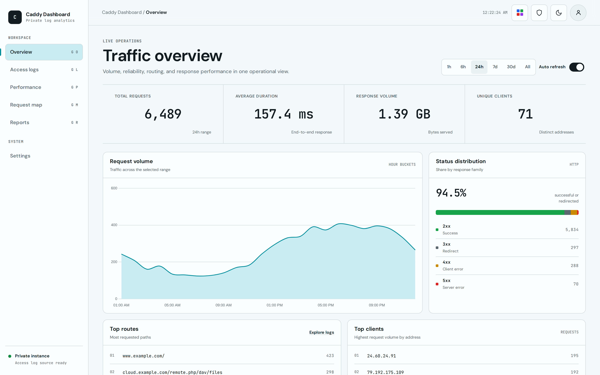
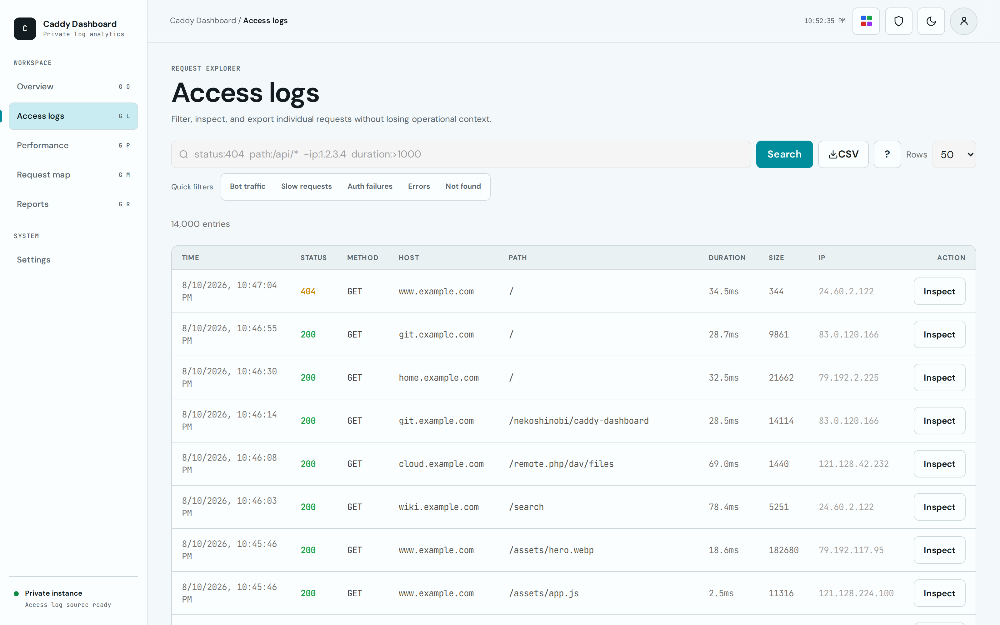
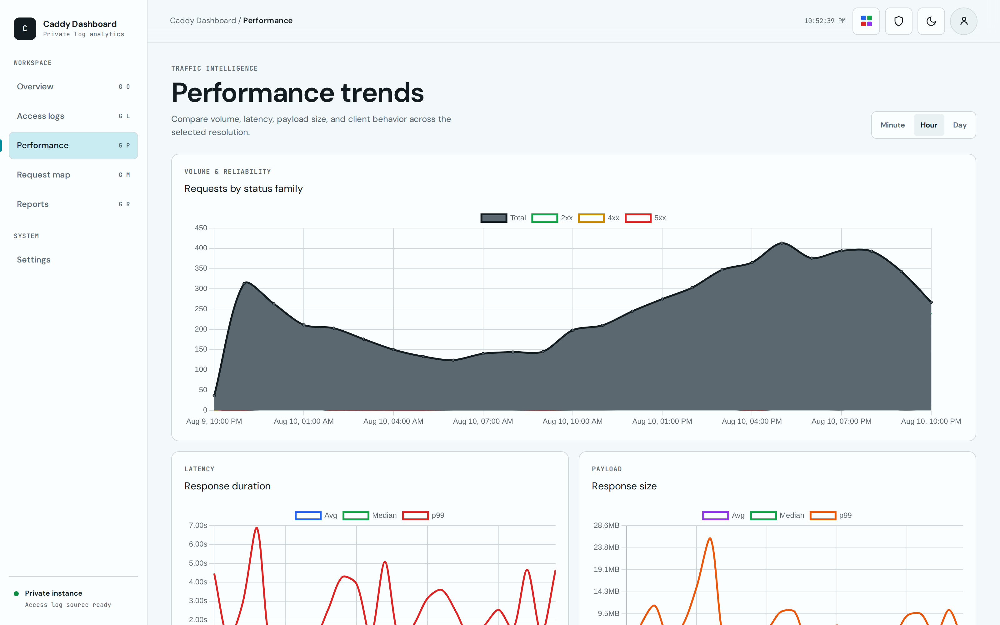
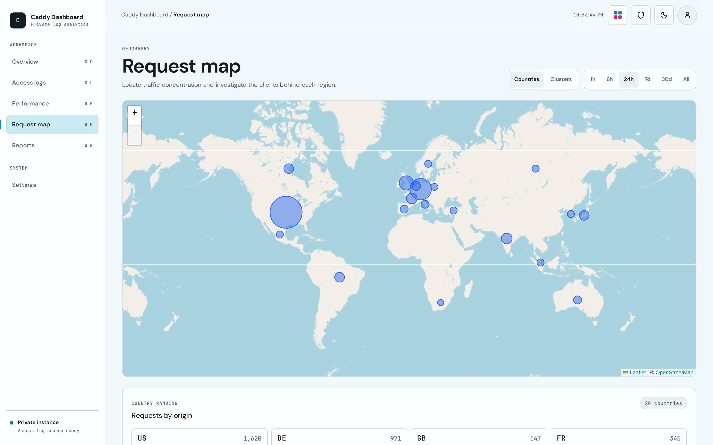

<div align="center">

# Caddy Dashboard

**See who is reaching your Caddy server, what they request, and how it responds.**

A private, self-hosted analytics dashboard built directly on Caddy's JSON access logs.

[](https://www.rust-lang.org/)
[](https://svelte.dev/)
[](https://www.docker.com/)
[](#how-it-works)

[Quick start](#quick-start) · [Using the dashboard](#using-the-dashboard) · [Configuration](#configuration) · [Development](#development)

</div>

<picture>
  <source media="(prefers-color-scheme: dark)" srcset="screenshots/overview-dark.png">
  
</picture>

## Why Caddy Dashboard?

Caddy already produces rich structured access logs. Caddy Dashboard turns them into useful answers without sending traffic data to a third party or requiring a separate analytics stack.

| Explore | Investigate | Understand | Control |
| :--- | :--- | :--- | :--- |
| Requests, hosts, paths, status codes, and latency | Search individual requests, inspect details, and export filtered CSV data | Follow trends, geographic origins, error rates, and large payloads | Keep data locally, set retention, manage users, and anonymize IPs in the UI |

### Highlights

- Live ingestion with automatic log-rotation detection
- Searchable, paginated request logs with CSV export
- Request, latency, payload, and unique-host time series
- Interactive request-origin map with an embedded GeoIP database
- Security reports for error-heavy clients and unusually large responses
- Optional local traffic analysis through [Ollama](https://ollama.com/)
- Local accounts, admin-managed users, and optional OIDC single sign-on
- Six color themes, light/dark mode, and an IP anonymization toggle
- A single Rust service with an embedded [redb](https://github.com/cberner/redb) database

## Quick start

### 1. Configure Caddy access logs

Caddy Dashboard reads Caddy's JSON file logs. Add a `log` block to each site you want to observe:

```caddyfile
example.com {
    log {
        output file /var/log/caddy/access.log {
            roll_size 30MB
            roll_keep 5
            roll_keep_for 720h
        }
    }

    reverse_proxy app:3000
}
```

The log file must exist on the Docker host and be readable by the dashboard container. If Caddy also runs in Docker, share the same log volume between the two services.

> [!IMPORTANT]
> On its first start, Caddy Dashboard begins at the end of the log file. Existing entries are not imported; new requests appear as Caddy writes them. After rotation or truncation, the replacement file is read from the beginning.

### 2. Start the dashboard

```bash
cp compose.example.yml compose.yml
```

Open `compose.yml` and replace the source side of the log mount with the real path from your Caddy configuration:

```yaml
volumes:
  - /var/log/caddy/access.log:/config/access.log:ro
  - caddy-dashboard-data:/data
```

Then build and start the service:

```bash
docker compose up --build -d
```

Open [http://localhost:9080](http://localhost:9080) and create the first admin account. Registration closes automatically after that account is created; admins can add more users from **Settings → User Management**.

> [!NOTE]
> Sessions use secure cookies by default. If you access the dashboard directly over local plain HTTP, set `COOKIE_SECURE=false` in `compose.yml`. Keep the default `true` when serving it over HTTPS.

### 3. Generate a request

Visit a site handled by Caddy, then refresh the dashboard. The new request should appear in **Overview** and **Access logs** within a moment.

If it does not, check that:

- Caddy is writing JSON entries to the mounted file.
- The host path in `compose.yml` points to that exact file.
- The file is readable inside the container at `/config/access.log`.
- The request happened after the dashboard's first startup.

## Using the dashboard

<table>
  <tr>
    <td width="50%">
      <picture>
        <source media="(prefers-color-scheme: dark)" srcset="screenshots/logs-dark.png">
        
      </picture>
      <br><sub><strong>Access logs</strong> — search, inspect, and export individual requests.</sub>
    </td>
    <td width="50%">
      <picture>
        <source media="(prefers-color-scheme: dark)" srcset="screenshots/graphs-dark.png">
        
      </picture>
      <br><sub><strong>Performance</strong> — compare traffic, latency, payload size, and unique hosts over time.</sub>
    </td>
  </tr>
  <tr>
    <td width="50%">
      <picture>
        <source media="(prefers-color-scheme: dark)" srcset="screenshots/map-dark.png">
        
      </picture>
      <br><sub><strong>Request map</strong> — explore request origins by country or precise cluster.</sub>
    </td>
    <td width="50%">
      <picture>
        <source media="(prefers-color-scheme: dark)" srcset="screenshots/overview-dark.png">
        
      </picture>
      <br><sub><strong>Overview</strong> — spot top hosts, paths, clients, status codes, and slow endpoints.</sub>
    </td>
  </tr>
</table>

### Find a request

Use the search field on **Access logs** to combine filters. Prefix a filter with `-` to exclude matching entries.

```text
status:4xx -path:/health* method:POST
```

| Filter | Example | Matches |
| :--- | :--- | :--- |
| `host:` | `host:example.com` | Hostname; `*` wildcards are supported |
| `path:` | `path:/api/*` | Request path |
| `ip:` | `ip:203.0.113.10` | Client IP address |
| `status:` | `status:404` or `status:4xx` | Exact code or status family |
| `method:` | `method:POST` | HTTP method |
| `size:>` / `size:<` | `size:>1048576` | Response size in bytes |

Select a row to see every captured request and response field or copy the original JSON. **Export CSV** applies the filters currently shown in the search field.

### Read trends and reports

- **Performance** groups data by minute, hour, or day and charts request volume, duration, response size, and unique hosts.
- **Request map** resolves request IPs with the embedded DB-IP Lite City database. When available, Caddy Dashboard can also fall back to Cloudflare's `Cf-Ipcountry` header.
- **Reports** identifies IPs with high 4xx/5xx rates and the largest response payloads.
- **AI Traffic Analysis** sends a summary of the last 24 hours to your configured Ollama server and streams its findings back to the report. No external AI provider is required.

### Manage privacy and access

- Toggle **Anonymize IPs** to blur client addresses throughout the interface.
- Choose a theme or light/dark mode from the appearance controls; preferences stay in the browser.
- Admins can create, update, and remove users from **Settings → User Management**.
- Set `RETENTION_DAYS` to automatically delete old request records.

## Configuration

All settings are environment variables. The example Compose file includes ready-to-edit entries for the common options.

### Core settings

| Variable | Default | Purpose |
| :--- | :--- | :--- |
| `PORT` | `9080` | Dashboard HTTP port |
| `LOG_PATH` | `/config/access.log` | Caddy JSON access-log path |
| `DATA_DIR` | `./data` | Directory containing the persistent redb database |
| `RETENTION_DAYS` | `0` | Delete records older than this many days; `0` keeps them indefinitely |
| `COOKIE_SECURE` | `true` | Require HTTPS when sending session cookies |
| `BASE_URL` | derived from request | Public URL, such as `https://dash.example.com`; set this behind a reverse proxy when using OIDC |
| `GEOIP_DB` | embedded database | Optional path to a MaxMind-compatible `.mmdb` database |
| `OLLAMA_HOST` | `http://localhost:11434` | Ollama API base URL |
| `OLLAMA_MODEL` | `llama3.2` | Installed Ollama model used for traffic analysis |

The `/data` volume is the durable source of historical analytics. The Caddy log file is treated as an incoming stream and can continue using normal rotation.

<details>
<summary><strong>OIDC / SSO settings</strong></summary>

Set `OIDC_CLIENT_ID`, `OIDC_CLIENT_SECRET`, and `OIDC_ISSUER_URL` to enable the SSO button. Register this callback with the provider:

```text
{BASE_URL}/api/auth/oidc/callback
```

| Variable | Default | Purpose |
| :--- | :--- | :--- |
| `OIDC_CLIENT_ID` | unset | Enables OIDC when set |
| `OIDC_CLIENT_SECRET` | unset | Provider client secret |
| `OIDC_ISSUER_URL` | unset | Provider issuer URL used for discovery |
| `OIDC_SCOPES` | `openid email profile` | Space-separated scopes; an email address is required |
| `OIDC_PROVIDERS_NAME` | `SSO` | Text displayed on the sign-in button |
| `OIDC_PROVIDER_LOGO_URL` | unset | Optional sign-in button logo |
| `OIDC_ADMIN_CLAIM` | unset | Claim inspected for administrator access, such as `groups` |
| `OIDC_ADMIN_VALUE` | unset | Claim value that grants administrator access |
| `OIDC_DISABLE_LOGIN` | `false` | Hide and disable local username/password login |
| `OIDC_REQUIRE_EMAIL_VERIFIED` | `true` | Reject accounts explicitly reported as having an unverified email |

OIDC accounts are matched to local accounts by email, case-insensitively. If admin claim mapping is not configured, the first OIDC user becomes an admin and later users start as non-admins. When claim mapping is configured, admin access is synchronized on every login.

</details>

<details>
<summary><strong>Recover administrator access</strong></summary>

Set `USER_DATABASE_RESET=true`, restart the service once, and then remove the variable immediately. This deletes all users, sessions, and stored OIDC tokens so a new initial admin can be created. Traffic analytics are not deleted.

</details>

## How it works

```text
Caddy JSON log
      │
      ▼
tail + parse ──► persistent redb storage ──► overview / logs / reports
      │                     │
      └──► live SSE stream  └──► minute / hour / day rollups ──► graphs
```

Each entry is parsed once. New writes update the raw record, search indexes, and analytics rollups together. The UI and API are served by the same Rust process, so production deployment needs only one application container and one persistent data volume.

GeoIP data is downloaded during the build and embedded in the binary. Set `SKIP_DBIP_DOWNLOAD=1` when building in an environment that must skip that download; the map can instead use an external database through `GEOIP_DB`.

## Development

The backend uses Rust nightly; the frontend uses Bun and SvelteKit. Install [Just](https://github.com/casey/just) and [Bacon](https://dystroy.org/bacon/) for the provided development workflow.

```bash
# Fetch locked Rust and frontend dependencies
just setup

# Run both development servers with live reload
just dev
```

The frontend is available through Vite and proxies `/api` requests to the backend on port `9080`. To append current-timestamp sample traffic while developing:

```bash
just inject-logs             # continuous stream, one request per second
just inject-logs 200         # one request every 200 ms
```

Before opening a change, run the full local check suite:

```bash
just ci
```

<div align="center">

Built for operators who want useful Caddy traffic insight without giving up ownership of their data.

</div>
